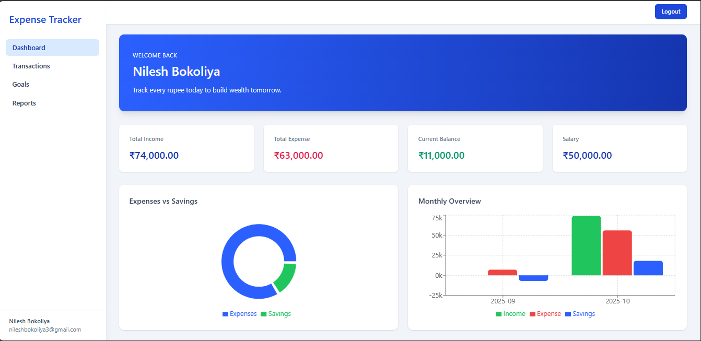

💰 Expense Tracker

A full-stack web application for personal finance management, enabling users to track income, expenses, set financial goals, and generate reports. Built using **React.js**, **Node.js**, **Express**, **Tailwind CSS**, and **MySQL**.


*Simplified financial control at your fingertips.*

📌 Description

The **Expense Tracker** system was developed to help individuals manage their personal finances efficiently. It addresses the challenges of manual tracking by offering a secure, user-friendly platform to record transactions, monitor spending, and plan for future goals.

🔍 What It Solves
- Eliminates manual ledger-based tracking
- Provides real-time financial insights
- Helps set and track savings goals
- Enables downloadable Excel reports for offline analysis

🎯 Why Built
- To demonstrate full-stack development skills
- Apply MVC architecture and RESTful API design
- Practice secure authentication and database normalization
- Create a production-ready financial tool

🧠 What Was Learned
- End-to-end project lifecycle management
- JWT-based authentication and session security
- Frontend-backend integration using Axios
- Report generation using ExcelJS
- Responsive UI design with React and Bootstrap

✨ What Makes It Stand Out
- Clean separation of concerns between `client` and `server`
- Modular backend with reusable controllers and middleware
- Real-time goal progress tracking with visual feedback
- Secure password hashing with bcrypt
- Deployed and accessible via public URL

📚 Table of Contents

- [Installation](#-installation)
- [Usage](#-usage)
- [Project Structure](#-project-structure)
- [Technologies Used](#-technologies-used)
- [API Endpoints](#-api-endpoints)
- [Features](#-features)
- [Testing](#-testing)
- [Deployment](#-deployment)
- [Contributors](#-contributors)
- [License](#-license)

⚙️ Installation

Follow these steps to run the project locally:

### Prerequisites
- Node.js (v16 or higher)
- MySQL (v8 recommended)
- npm or yarn


## Project Structure

```
Expense Tracker/
├── client/                 # Frontend React Application
│   └── src/
│       ├── components/     # Reusable UI components
│       ├── context/       # React Context providers
│       ├── lib/           # Utility functions
│       ├── pages/         # Application pages
│       └── services/      # API service functions
├── server/                # Backend Node.js Application
    └── src/
        ├── config/        # Configuration files
        ├── controllers/   # Request handlers
        ├── middlewares/   # Express middlewares
        ├── models/        # Database models
        ├── routes/        # API routes
        ├── utils/         # Utility functions
        └── validators/    # Input validation
```

## Features

- User Authentication (Login/Register)
- Password Reset Functionality
- Transaction Management
- Financial Goals Setting
- Reports Generation
- Dashboard Analytics

## Technology Stack

### Frontend
- React.js
- Vite
- Tailwind CSS
- ESLint
- Context API for state management

### Backend
- Node.js
- Express.js
- PostgreSQL
- JWT Authentication
- Email Service Integration

## Key Components

### Frontend Pages
- `HomePage`: Landing page
- `DashboardPage`: Main user dashboard
- `TransactionsPage`: Manage expenses/income
- `GoalsPage`: Set and track financial goals
- `ReportsPage`: Generate financial reports
- `LoginPage`/`RegisterPage`: Authentication
- `ForgotPasswordPage`/`ResetPasswordPage`: Password recovery

### Backend Features
- RESTful API endpoints
- Secure password hashing
- JWT token management
- Database schema management
- Input validation
- Protected routes middleware

## Getting Started

### Frontend Setup
1. Navigate to the client directory:
```bash
cd client
```

2. Install dependencies:
```bash
npm install
```

3. Start development server:
```bash
npm run dev
```

### Backend Setup
1. Navigate to the server directory:
```bash
cd server
```

2. Install dependencies:
```bash
npm install
```

3. Set up environment variables:
- Create a `.env` file based on `.env.example`
- Configure database credentials
- Set JWT secret
- Configure email service

4. Run database migrations:
- Execute schema.sql in your MySQL database

5. Start the server:
```bash
npm start
```

## API Endpoints

### Authentication
- POST `/api/auth/register` - User registration
- POST `/api/auth/login` - User login
- POST `/api/auth/forgot-password` - Password reset request
- POST `/api/auth/reset-password` - Password reset

### Transactions
- GET `/api/transactions` - Get all transactions
- POST `/api/transactions` - Create new transaction
- PUT `/api/transactions/:id` - Update transaction
- DELETE `/api/transactions/:id` - Delete transaction

### Goals
- GET `/api/goals` - Get all goals
- POST `/api/goals` - Create new goal
- PUT `/api/goals/:id` - Update goal
- DELETE `/api/goals/:id` - Delete goal

### Reports
- GET `/api/reports/summary` - Get financial summary
- GET `/api/reports/category` - Get category-wise analysis

## Security Features

- JWT-based authentication
- Password hashing
- Protected API routes
- Input validation and sanitization
- Secure password reset flow

## Testing

The server includes test suites for:
- Health check endpoints
- Protected routes authentication
- API functionality

Run tests using:
```bash
cd server
npm test
```

## Contributing

1. Fork the repository
2. Create your feature branch
3. Commit your changes
4. Push to the branch
5. Create a new Pull Request

## License

This project is licensed under the MIT License.